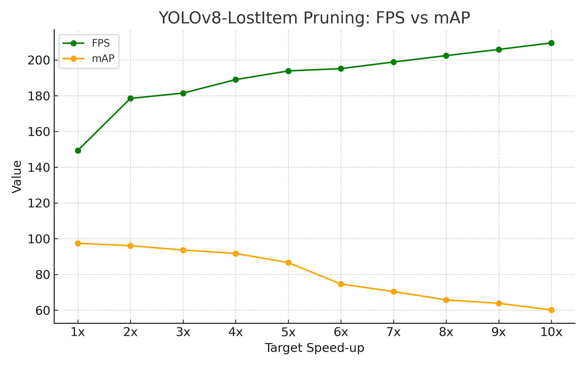

# 🚀 YOLOv8(경량화) 분실물 탐지

YOLOv8 기반으로 **택시 내 분실물(휴대폰 등) 실시간 탐지**를 수행하며,  
**Torch-Pruning**을 활용한 모델 경량화로 FPS와 경량성(mAP/MACs)을 최적화한 프로젝트입니다.

---

## ✨ 주요 기능
- 🔍 **YOLOv8s 기반 객체 탐지**: 휴대폰 등 소형 분실물 인식
- ⚡ **Torch-Pruning 경량화**: MACs, 파라미터 수, 모델 크기 감소
- 📊 **자동 성능 평가**: mAP, FPS, MACs 비교
- 🔔 **실시간 경고 시스템**: 분실물 감지 시 경고음 발생
- 📈 **경량화 전/후 성능 로그 기록**

---

## 🛠 기술 스택

---

## 📂 프로젝트 구조
📦 yolov8-lostitem-pruning  
┣ 📂 configs # Pruning 설정 파일(예: pruning_config.yaml)  
┣ 📂 dataset # 데이터셋 및 data.yaml  
┣ 📂 results # 성능 결과/그래프/로그  
┣ 📂 weights # 학습/경량화된 가중치(.pt)  
┣ 📜 yolov8_basic.py # 기본 학습 스크립트  
┣ 📜 yolov8_pruning.py # 모델 경량화 + mAP/MACs/FPS 평가  
┣ 📜 image_test.py # 이미지 단일/배치 추론  
┣ 📜 fps_test.py # FPS 측정 스크립트  
┣ 📜 newwarning.py # 실시간 탐지 + 경고음 알림  
┣ 📜 requirements.txt # 의존성 목록  
┗ 📜 README.md # 문서  

## 📊 성능 비교

| Target Speed-up | Model 크기 (MB) | GFLOPs | FPS    | mAP  |
|-----------------|-----------------|--------|--------|------|
| 1x              | 21.4            | 28.5   | 149.38 | 97.5 |
| 2x              | 13.1            | 7.7    | 178.52 | 96.1 |
| 3x              | 7.82            | 6.6    | 181.46 | 93.7 |
| 4x              | 5.76            | 5.3    | 189.03 | 91.8 |
| 5x              | 4.79            | 4.7    | 193.89 | 86.7 |
| 6x              | 4.24            | 4.4    | 195.18 | 74.7 |
| 7x              | 3.89            | 4.2    | 198.87 | 70.5 |
| 8x              | 3.64            | 4.1    | 202.45 | 65.8 |
| 9x              | 3.48            | 3.9    | 205.91 | 63.9 |
| 10x             | 3.33            | 3.8    | 209.57 | 60.2 |

### 📈 FPS vs mAP 변화

### 📌 모델 경량화 선택 이유
- 분석 결과, **Target Speed-up 2x (약 50% Pruning)** 적용 시 mAP 감소폭이 **1.4%**로 매우 작으면서도 FPS가 약 **1.2배** 향상됨.
- 그 이상의 Speed-up은 FPS 향상폭이 크지 않은 반면, mAP 손실이 급격히 증가.
- **따라서, 본 시스템에는 Target Speed-up 2x를 적용하기로 최종 결정함.**

## 🖼 데모 영상

